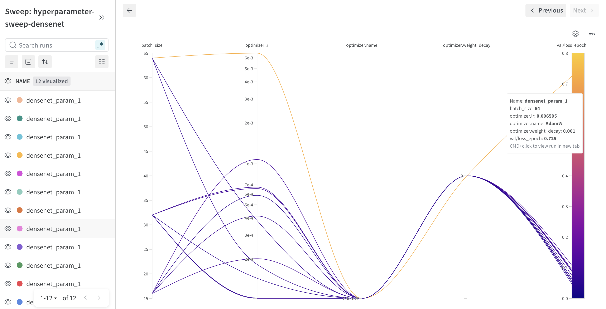
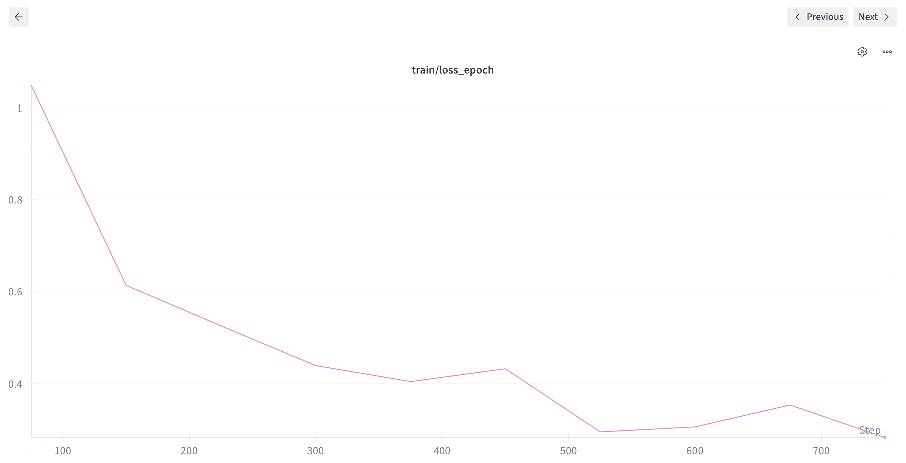
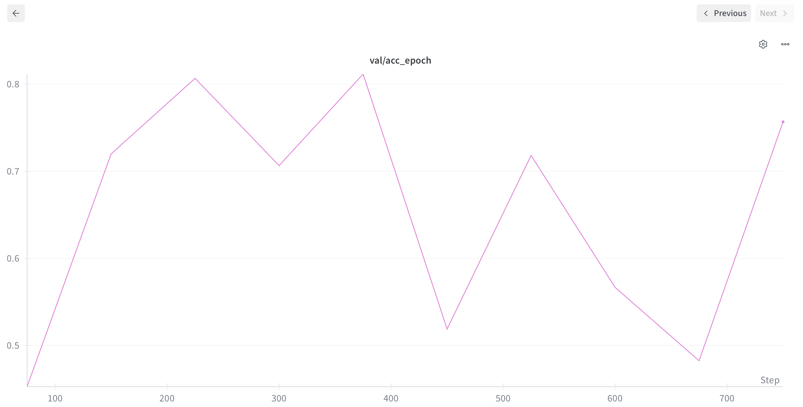
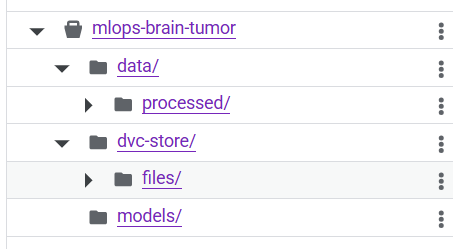
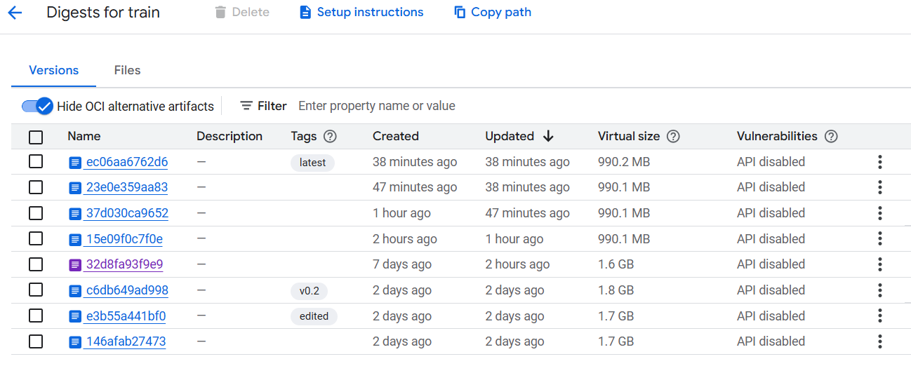
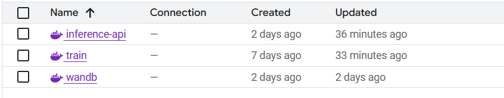
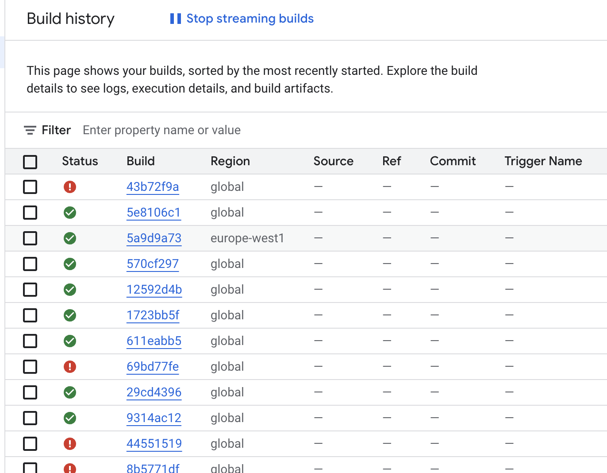
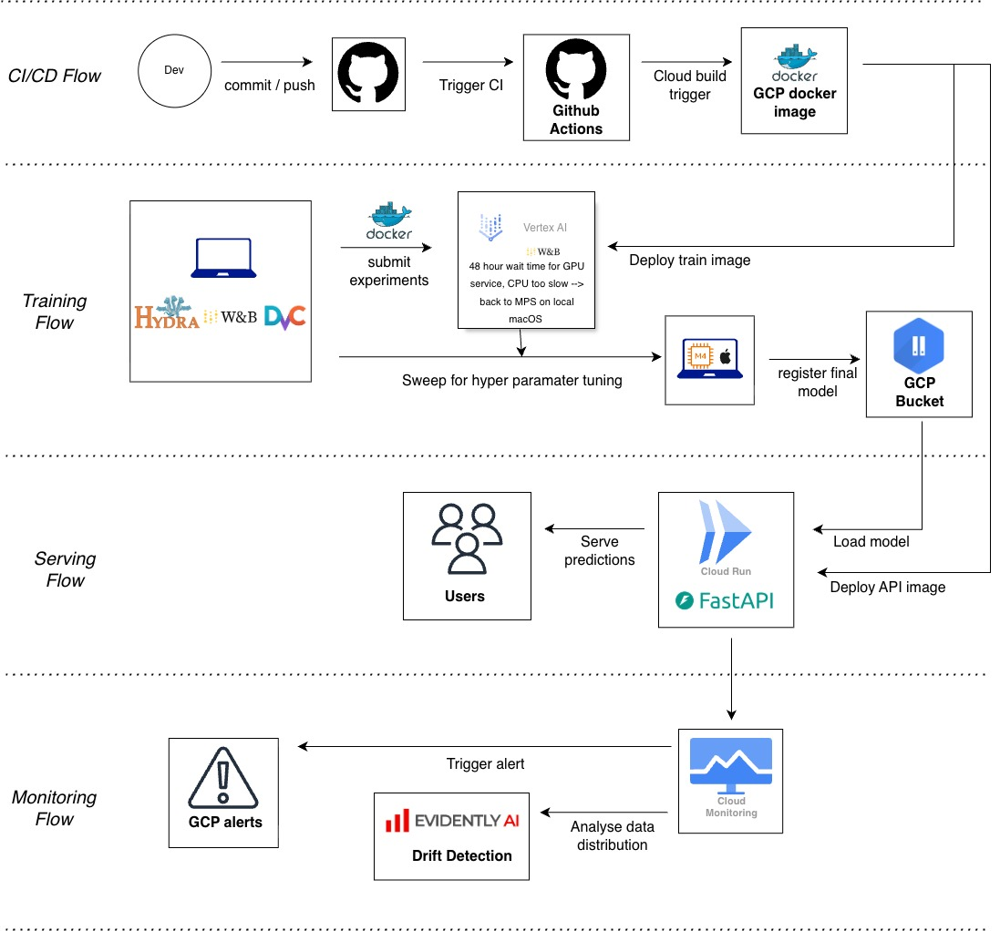

# Exam template for 02476 Machine Learning Operations

This is the report template for the exam. Please only remove the text formatted as with three dashes in front and behind
like:

```--- question 1 fill here ---```

Where you instead should add your answers. Any other changes may have unwanted consequences when your report is
auto-generated at the end of the course. For questions where you are asked to include images, start by adding the image
to the `figures` subfolder (please only use `.png`, `.jpg` or `.jpeg`) and then add the following code in your answer:

``

In addition to this markdown file, we also provide the `report.py` script that provides two utility functions:

Running:

```bash
python report.py html
```

Will generate a `.html` page of your report. After the deadline for answering this template, we will auto-scrape
everything in this `reports` folder and then use this utility to generate a `.html` page that will be your serve
as your final hand-in.

Running

```bash
python report.py check
```

Will check your answers in this template against the constraints listed for each question e.g. is your answer too
short, too long, or have you included an image when asked. For both functions to work you mustn't rename anything.
The script has two dependencies that can be installed with

```bash
pip install typer markdown
```

or

```bash
uv add typer markdown
```

## Overall project checklist

The checklist is *exhaustive* which means that it includes everything that you could do on the project included in the
curriculum in this course. Therefore, we do not expect at all that you have checked all boxes at the end of the project.
The parenthesis at the end indicates what module the bullet point is related to. Please be honest in your answers, we
will check the repositories and the code to verify your answers.

### Week 1

* [x] Create a git repository (M5)
* [x] Make sure that all team members have write access to the GitHub repository (M5)
* [x] Create a dedicated environment for you project to keep track of your packages (M2)
* [x] Create the initial file structure using cookiecutter with an appropriate template (M6)
* [x] Fill out the `data.py` file such that it downloads whatever data you need and preprocesses it (if necessary) (M6)
* [x] Add a model to `model.py` and a training procedure to `train.py` and get that running (M6)
* [x] Remember to fill out the `requirements.txt` and `requirements_dev.txt` file with whatever dependencies that you
    are using (M2+M6)
* [x] Remember to comply with good coding practices (`pep8`) while doing the project (M7)
* [x] Do a bit of code typing and remember to document essential parts of your code (M7)
* [x] Setup version control for your data or part of your data (M8)
* [x] Add command line interfaces and project commands to your code where it makes sense (M9)
* [x] Construct one or multiple docker files for your code (M10)
* [x] Build the docker files locally and make sure they work as intended (M10)
* [x] Write one or multiple configurations files for your experiments (M11)
* [x] Used Hydra to load the configurations and manage your hyperparameters (M11)
* [x] Use profiling to optimize your code (M12)
* [x] Use logging to log important events in your code (M14)
* [x] Use Weights & Biases to log training progress and other important metrics/artifacts in your code (M14)
* [x] Consider running a hyperparameter optimization sweep (M14)
* [ ] Use PyTorch-lightning (if applicable) to reduce the amount of boilerplate in your code (M15)

### Week 2

* [x] Write unit tests related to the data part of your code (M16)
* [x] Write unit tests related to model construction and or model training (M16)
* [x] Calculate the code coverage (M16)
* [x] Get some continuous integration running on the GitHub repository (M17)
* [x] Add caching and multi-os/python/pytorch testing to your continuous integration (M17)
* [x] Add a linting step to your continuous integration (M17)
* [x] Add pre-commit hooks to your version control setup (M18)
* [ ] Add a continues workflow that triggers when data changes (M19)
* [ ] Add a continues workflow that triggers when changes to the model registry is made (M19)
* [x] Create a data storage in GCP Bucket for your data and link this with your data version control setup (M21)
* [x] Create a trigger workflow for automatically building your docker images (M21)
* [x] Get your model training in GCP using either the Engine or Vertex AI (M21)
* [x] Create a FastAPI application that can do inference using your model (M22)
* [x] Deploy your model in GCP using either Functions or Run as the backend (M23)
* [x] Write API tests for your application and setup continues integration for these (M24)
* [x] Load test your application (M24)
* [ ] Create a more specialized ML-deployment API using either ONNX or BentoML, or both (M25)
* [ ] Create a frontend for your API (M26)

### Week 3

* [x] Check how robust your model is towards data drifting (M27)
* [ ] Deploy to the cloud a drift detection API (M27)
* [x] Instrument your API with a couple of system metrics (M28)
* [x] Setup cloud monitoring of your instrumented application (M28)
* [x] Create one or more alert systems in GCP to alert you if your app is not behaving correctly (M28)
* [ ] If applicable, optimize the performance of your data loading using distributed data loading (M29)
* [ ] If applicable, optimize the performance of your training pipeline by using distributed training (M30)
* [ ] Play around with quantization, compilation and pruning for you trained models to increase inference speed (M31)

### Extra

* [x] Write some documentation for your application (M32)
* [x] Publish the documentation to GitHub Pages (M32)
* [x] Revisit your initial project description. Did the project turn out as you wanted?
* [x] Create an architectural diagram over your MLOps pipeline
* [x] Make sure all group members have an understanding about all parts of the project
* [x] Uploaded all your code to GitHub

## Group information

### Question 1
> **Enter the group number you signed up on <learn.inside.dtu.dk>**
>
> Answer: 

53

### Question 2
> **Enter the study number for each member in the group**
>
>
> Answer: 

s243656 , s204153, s252263, s243659

### Question 3
> **A requirement to the project is that you include a third-party package not covered in the course. What framework**
> **did you choose to work with and did it help you complete the project?**
>
> Recommended answer length: 100-200 words.
>
>
> Answer: 

We made use of a package called MONAI, which is a deep learning, PyTorch-based framework specifically designed for medical imaging applications. The overall plan of the project is to implement a model using this framework, train it on medical imaging data, and evaluate the resulting performance. MONAI provides a range of ready-made modules for deep learning architectures, data handling, and training pipelines, which we make use of throughout the project to simplify development and ensure best practices within medical imaging.

In the setup phase, we first familiarize ourselves with the MONAI framework and its core components. We then implement a baseline model using MONAI’s architecture modules and training utilities. To better understand the benefits and limitations of the framework, we compare this MONAI-based model against another deep learning model that is implemented without using the MONAI package. This comparison allows us to assess differences in performance, implementation complexity, and flexibility, and helps us evaluate whether MONAI provides a meaningful advantage for our specific medical imaging task.

## Coding environment

> In the following section we are interested in learning more about you local development environment. This includes
> how you managed dependencies, the structure of your code and how you managed code quality.

### Question 4

> **Explain how you managed dependencies in your project? Explain the process a new team member would have to go**
> **through to get an exact copy of your environment.**
>
> Recommended answer length: 100-200 words
>
> Answer: 

We used uv to manage our dependencies, as it allows us to automatically handle and update dependencies within the project, removing the tedious job of adding them manually. Whenever we wanted to add a new package, we used the "command uv add <package name>", which automatically added it to the uv lock file that stores all required packages and versions. This approach ensures consistency across the project. In this way, everyone can activate and work within the same virtual environment, provided that we regularly pull updates and work on the most recent version of the project during collaborative team development.

### Question 5

> **We expect that you initialized your project using the cookiecutter template. Explain the overall structure of your**
> **code. What did you fill out? Did you deviate from the template in some way?**
>
> Recommended answer length: 100-200 words
>
> Answer: 

The cookiecutter template is very nicely set up for developing a model and its related files in a clear and well-structured format. We have filled out the data, evaluate, model, train, and visualize files required for the model setup and experimentation. In addition, we completed several of the workflow files to ensure proper version control and automated checks on GitHub. To make sure that figures, plots, and other testing notes are kept in a single, organized location, we used the figures folder within the reports directory to store these outputs. Finally, to properly configure the models and training procedures, we populated the configs folder with the corresponding configuration files for each experiment.

### Question 6

> **Did you implement any rules for code quality and format? What about typing and documentation? Additionally,**
> **explain with your own words why these concepts matters in larger projects.**
>
> Recommended answer length: 100-200 words.
>
>
> Answer: 

We implemented rules for code quality in the linting file within the workflows folder. For this we use ruff format and ruff check to make sure the code is both consistent with the standard and see if any problems need to be fixed. For documentation we made sure to add relevant comments when necessary. We also documented... 

These concepts matter greatly in larger projects because they make the codebase easier to understand, maintain, and extend over time. When multiple people work on the same project, consistent formatting, typing, and documentation reduce confusion and lower the risk of errors. They also make onboarding new contributors faster and help ensure that changes can be made confidently without breaking existing functionality.


## Version control

> In the following section we are interested in how version control was used in your project during development to
> corporate and increase the quality of your code.

### Question 7

> **How many tests did you implement and what are they testing in your code?**
>
> Recommended answer length: 50-100 words.
>
> Example:
> *In total we have implemented X tests. Primarily we are testing ... and ... as these the most critical parts of our*
> *application but also ... .*
>
> Answer: 

We implemented 11 tests, which make sure that both the data and the model runs smoothly every time we push something new into the project. It runs both pytests and coverage. 
For the data it does: check dataset loads correctly, verify the number og samples in training and test set, validate that each image is a 3d tensor in correct format and ensures correct label format. 
The model test makes sure the model can run with different batch sizes and that the output format is correct. 

### Question 8

> **What is the total code coverage (in percentage) of your code? If your code had a code coverage of 100% (or close**
> **to), would you still trust it to be error free? Explain you reasoning.**
>
> Recommended answer length: 100-200 words.
>
> Example:
> *The total code coverage of code is X%, which includes all our source code. We are far from 100% coverage of our **
> *code and even if we were then...*
>
> Answer: 

The total code coverage of the report is 26%, which includes all our source code. The tests are for loading and preprocessing data, model testing, and tests for the utility functions. Code coverage is a good indicator that the code has been tested, but is a measure of how many lines of code we run when executing the unittests, and therefore not guarantee error free code. There could be edge cases that one does not account for when doing unittests.

### Question 9

> **Did you workflow include using branches and pull requests? If yes, explain how. If not, explain how branches and**
> **pull request can help improve version control.**
>
> Recommended answer length: 100-200 words.
>
>
> Answer: 

Yes, we both made use of both branches and PRs. Everytime we would work on a specific issue/feature of the project, we build a branch related to this such that we might merge it on later. Pull requests were also used to make sure someone has gone through and confirmed the proposed code/update. This gave us a nice workflow because we could perform tests automatically by running it through the workflows we had setup which both checked formatting, quality and coverage, which makes it alot easier to improve and debug relevant code. If we hadn't done this, it would've been a lot harder to solve conflict because nobody would need to approve or test the update. 


### Question 10

> **Did you use DVC for managing data in your project? If yes, then how did it improve your project to have version**
> **control of your data. If no, explain a case where it would be beneficial to have version control of your data.**
>
> Recommended answer length: 100-200 words.
>
> Example:
> *We did make use of DVC in the following way: ... . In the end it helped us in ... for controlling ... part of our*
> *pipeline*
>
> Answer:
In our project, we did setup data version control using DVC for managing data, but was setup late in the process. 
Since we are using a single fixed benchmark dataset, data version control was not that neccesary, was setup anyway.
We only did preprocessing in the beginning and also this was the task of only one team member. So the dataset was stable and also relatively small, making manual handling sufficient for our use case.
However, data version control would become highly beneficial in more complex scenarios, particularly when datasets evolve over time or multiple experiments depend on different data states. When data preprocessing would be a more iterative process it would be very helpful to have some sort of DVC. With that each processed version of the dataset can be versioned and linked to a specific experiment or model. This makes it possible to reproduce results exactly and to compare how changes in the data influence model performance.
Another important use case is collaborative work. When multiple team members modify or extend a dataset (for example, adding new samples or correcting labels), DVC helps track who changed what and when. 

### Question 11

> **Discuss you continuous integration setup. What kind of continuous integration are you running (unittesting,**
> **linting, etc.)? Do you test multiple operating systems, Python  version etc. Do you make use of caching? Feel free**
> **to insert a link to one of your GitHub actions workflow.**
>
> Recommended answer length: 200-300 words.
>
> Example:
> *We have organized our continuous integration into 3 separate files: one for doing ..., one for running ... testing*
> *and one for running ... . In particular for our ..., we used ... .An example of a triggered workflow can be seen*
> *here: <weblink>*
>
> Answer: 

Our continuous integration setup uses GitHub Actions to automatically run code linting and unit tests on every push and pull request to the main branch. The workflows execute ruff-based linting and formatting checks as well as pytest-based unit tests with coverage across multiple operating systems (Linux, Windows, and macOS) using a fixed Python version, with dependency caching enabled to speed up execution.

[Linting workflow](https://github.com/SmillaDue/mlops_g53/actions/runs/21037845125/workflow)
[Unit test workflow](https://github.com/SmillaDue/mlops_g53/actions/runs/21183711060/workflow)

## Running code and tracking experiments

> In the following section we are interested in learning more about the experimental setup for running your code and
> especially the reproducibility of your experiments.

### Question 12

> **How did you configure experiments? Did you make use of config files? Explain with coding examples of how you would**
> **run a experiment.**
>
> Recommended answer length: 50-100 words.
>
> Example:
> *We used a simple argparser, that worked in the following way: Python  my_script.py --lr 1e-3 --batch_size 25*
>
> Answer: 

We configured our experiments using Hydra-based configuration files. A default configuration defines global settings such as logging and training parameters, which is then composed with separate training and model-specific configuration files. This allows us to easily switch models or adjust hyperparameters without changing the training code. Experiments can be run by overriding configuration values.


### Question 13

> **Reproducibility of experiments are important. Related to the last question, how did you secure that no information**
> **is lost when running experiments and that your experiments are reproducible?**
>
> Recommended answer length: 100-200 words.
>
> Example:
> *We made use of config files. Whenever an experiment is run the following happens: ... . To reproduce an experiment*
> *one would have to do ...*
>
> Answer:

Reproducibility was ensured by running all experiments in a controlled and fully logged environment. Training is driven by Hydra configuration files, meaning that all hyperparameters, model choices, optimizer settings, and logging options are defined declaratively and can be reproduced by rerunning the same configuration. For each run, the fully resolved configuration is logged to Weights & Biases, ensuring that no information about the experimental setup is lost.
During training, step-level, epoch-level, and final performance metrics are logged, providing a complete record of the training process. In addition, trained model checkpoints are stored as Weights & Biases artifacts, which allows specific models to be traced back to the exact run and configuration that produced them. Random seeds are fixed for model initialization and dataset splitting to reduce variability across runs.


### Question 14

> **Upload 1 to 3 screenshots that show the experiments that you have done in W&B (or another experiment tracking**
> **service of your choice). This may include loss graphs, logged images, hyperparameter sweeps etc. You can take**
> **inspiration from [this figure](figures/wandb.png). Explain what metrics you are tracking and why they are**
> **important.**
>
> Recommended answer length: 200-300 words + 1 to 3 screenshots.
>
> Example:
> *As seen in the first image when have tracked ... and ... which both inform us about ... in our experiments.*
> *As seen in the second image we are also tracking ... and ...*
>
> Answer:

In the first image you could see an overview of the sweep. Here it is a very basic one mainly observing the batch size and learning rate.

In the next picutre you can see that we also track the loss value of our training. This one is for our best sweep run from above.

In the last figure, we report the model’s accuracy on the test dataset using the best-performing sweep configuration.



### Question 15

> **Docker is an important tool for creating containerized applications. Explain how you used docker in your**
> **experiments/project? Include how you would run your docker images and include a link to one of your docker files.**
>
> Recommended answer length: 100-200 words.
>
> Example:
> *For our project we developed several images: one for training, inference and deployment. For example to run the*
> *training docker image: `docker run trainer:latest lr=1e-3 batch_size=64`. Link to docker file: <weblink>*
>
> Answer: 

Docker was used in our project to containerize different parts of the machine-learning pipeline. We created Docker images for training the model so that the training process and dependencies were consistent and reproducible across machines. The trained model was saved and included in a Docker image, making it easy to share and deploy the model.
We also used Docker to build images for an API that serves the model in the cloud. This API was implemented using FastAPI and Uvicorn and deployed using Cloud Run. As the project developed, Docker images were rebuilt and updated automatically using Cloud Build through configuration files such as cloudbuild.yaml. This allowed the API and model to be updated continuously when changes were made to the code.
Docker images were built using docker build and run locally with docker run, including port mapping and environment variables when required.

[Link to trained model docker file](https://console.cloud.google.com/artifacts/docker/mlops-g53/europe-west1/mlops-g53-repo/wandb?project=mlops-g53)


--- question 15 fill here ---

### Question 16

> **When running into bugs while trying to run your experiments, how did you perform debugging? Additionally, did you**
> **try to profile your code or do you think it is already perfect?**
>
> Recommended answer length: 100-200 words.
>
> Example:
> *Debugging method was dependent on group member. Some just used ... and others used ... . We did a single profiling*
> *run of our main code at some point that showed ...*
>
> Answer: 

Shame on us, but we mostly relied on the very much loved print statements when debugging, and we do not regret it ;) They were helpful for quickly understanding what was happening in the code and for identifying where things went wrong. That said, in the future it would definitely be more well-mannered to use the built-in Python debugger or IDE debugging tools, especially as the project grows in complexity.
We also used a profiler, and based on the results we changed our data preprocessing pipeline. Instead of loading all data at once, we refactored the code to work in batches. This improved memory usage and made the training process more efficient overall.


## Working in the cloud

> In the following section we would like to know more about your experience when developing in the cloud.

### Question 17

> **List all the GCP services that you made use of in your project and shortly explain what each service does?**
>
> Recommended answer length: 50-200 words.
>
> Example:
> *We used the following two services: Engine and Bucket. Engine is used for... and Bucket is used for...*
>
> Answer: 

We used the following: 
Cloud run functions : To create and Setup functions/models in the cloud as an API.
Cloud build : To build into containers or artifacts in the cloud, which was build when we create a new cloud function 
Buckets: Buckets are online storage for data, which we used to save both out trainining and test data. 
Cloud Engine : Cloud Engine is an online service which makes it possible to train your model on another computer. This we used to train our model  
Artifacts : Artifacts is a place to create repositories where you can store docker images for your API’s or models, which we also did. 
Storage : We used buckets, which is a part of the cloud storage service. 

### Question 18

> **The backbone of GCP is the Compute engine. Explained how you made use of this service and what type of VMs**
> **you used?**
>
> Recommended answer length: 100-200 words.
>
> Example:
> *We used the compute engine to run our ... . We used instances with the following hardware: ... and we started the*
> *using a custom container: ...*
>
> Answer: 

In our project, Google Compute Engine was used as the underlying infrastructure for cloud-based training jobs. We did not interact with Compute Engine directly; instead, it was accessed through Vertex AI, which automatically provisions and manages virtual machines for each training job.
For all experiments, we relied exclusively on CPU-based Compute Engine instances, specifically n1-standard-2 virtual machines. Although GPU-enabled virtual machines were available, we did not use them because GPU quota approval was required and could not be obtained within the project timeframe.
By using Compute Engine through Vertex AI, virtual machines were created on demand for each job and automatically shut down after completion, ensuring efficient resource usage without manual infrastructure management.

### Question 19

> **Insert 1-2 images of your GCP bucket, such that we can see what data you have stored in it.**
> **You can take inspiration from [this figure](figures/bucket.png).**
>
> Answer:



### Question 20

> **Upload 1-2 images of your GCP artifact registry, such that we can see the different docker images that you have**
> **stored. You can take inspiration from [this figure](figures/registry.png).**
>
> Answer:




### Question 21

> **Upload 1-2 images of your GCP cloud build history, so we can see the history of the images that have been build in**
> **your project. You can take inspiration from [this figure](figures/build.png).**
>
> Answer:



### Question 22

> **Did you manage to train your model in the cloud using either the Engine or Vertex AI? If yes, explain how you did**
> **it. If not, describe why.**
>
> Recommended answer length: 100-200 words.
>
> Example:
> *We managed to train our model in the cloud using the Engine. We did this by ... . The reason we choose the Engine*
> *was because ...*
>
> Answer: 

Yes, we successfully trained our model in the cloud using Vertex AI. The training code was containerized using Docker and executed as a Vertex AI custom job, allowing the model to be trained in a scalable and reproducible cloud environment.
To train models, do sweeping and building images we created both configuration files and shell scripts.
Training jobs were submitted using the gcloud ai custom-jobs create command, which referenced a container image stored in Google Artifact Registry. Vertex AI handled the full execution workflow, including starting the container, running the training script, and managing job lifecycle events. All training runs were executed consistently using the same container image and configuration files, ensuring reproducibility across experiments.
This approach allowed us to run training and hyperparameter sweeps in the cloud without managing virtual machines manually, while still benefiting from cloud scalability and centralized experiment tracking.


## Deployment

### Question 23

> **Did you manage to write an API for your model? If yes, explain how you did it and if you did anything special. If**
> **not, explain how you would do it.**
>
> Recommended answer length: 100-200 words.
>
> Example:
> *We did manage to write an API for our model. We used FastAPI to do this. We did this by ... . We also added ...*
> *to the API to make it more ...*
>
> Answer: 

Yes, we managed to create an API for our model. We implemented the API using the FastAPI framework. The API loads the weights of the final trained model from a cloud bucket, which allows the model to be accessed without storing the weights locally in the application. We then defined an inference function and decorated it with @app.post("/inference"). This endpoint takes an image uploaded by the user as input. The image is first saved and then preprocessed, in the exact same way as the raw data was preprocessed, such that it matches the input format expected by the model. After preprocessing, the image is passed through the model to generate predictions. The API then returns the class probabilities as the output, representing the model’s confidence for each class. In addition, the response includes a URL pointing to the processed image.

### Question 24

> **Did you manage to deploy your API, either in locally or cloud? If not, describe why. If yes, describe how and**
> **preferably how you invoke your deployed service?**
>
> Recommended answer length: 100-200 words.
>
> Example:
> *For deployment we wrapped our model into application using ... . We first tried locally serving the model, which*
> *worked. Afterwards we deployed it in the cloud, using ... . To invoke the service an user would call*
> *`curl -X POST -F "file=@file.json"<weburl>`*
>
> Answer: 

Yes we managed to deploy both an API based on a docker image and another using cloud functions. The one using a docker image was made by using our API described in question 23. An API dockerfile was created which runs the model and sets up the API with the fastapi framework on port 8080. For Setting it up on the cloud, we made a cloudbuild.yaml file, which constructs the container image and deploys it to cloud run with the relevans Settings. 
The API deployer without an image was deployed with the cloud run functions by Setting up a main.py file and a requirements.txt file. It works on the same model as the one build on the docker image, but returns the argmax of the class probabilities. 

To invoke the service you would execute 

Image API: 
curl -X POST "https://inference-api-124059837854.europe-west1.run.app/inference" \
 - F "data=<path to image file>”

curl -X GET \
  "https://inference-api-124059837854.europe-west1.run.app/inference/image_preprocessed.png" \
  -o image_preprocessed.png

Functions API: 
curl -X POST "https://europe-west1-mlops-g53.cloudfunctions.net/brain-inference-api-via-functions" \
 - F "file=<path to image file>” 

### Question 25

> **Did you perform any unit testing and load testing of your API? If yes, explain how you did it and what results for**
> **the load testing did you get. If not, explain how you would do it.**
> 
> Recommended answer length: 100-200 words.
>
> Example:
> *For unit testing we used ... and for load testing we used ... . The results of the load testing showed that ...*
> *before the service crashed.*
>
> Answer:

We did perform unit tests to test the response from the API, to check whether it responded correctly. Our inference API expects an image of any size, and will resize it to fit as input to the model. Therefore we do a random generated array and post it to the API, and checks whether it responded correctly. If we had done load testing we would have used locust and define the tasks a user could do. Then run the loadtest where each "user" repeatedly send image inference requests, sometimes querying the root and the fetching of a preprocessed image. With locust we could gradually increase the number of users and get measures like response time, througput and amount of errors. Doing the load testing would give insights of the API's performance bottlenecks and scalability. Additionaly we could have added the load test to our CI/CD pipeline.

### Question 26

> **Did you manage to implement monitoring of your deployed model? If yes, explain how it works. If not, explain how**
> **monitoring would help the longevity of your application.**
>
> Recommended answer length: 100-200 words.
>
> Example:
> *We did not manage to implement monitoring. We would like to have monitoring implemented such that over time we could*
> *measure ... and ... that would inform us about this ... behaviour of our application.*
>
> Answer: 

We implemented monitoring for our deployed model using Google Cloud Run and Google Cloud Monitoring. Cloud Run automatically provides system-level metrics such as request count, request latency, CPU utilization, memory usage, and HTTP response codes. These built-in metrics allow us to monitor the health and performance of the deployed inference API without adding additional instrumentation code.
Based on these metrics, we configured alerting policies in Google Cloud Monitoring. One alert triggers when server-side errors (HTTP 5xx responses) occur, indicating that the application is not behaving correctly. A second alert monitors the request latency using the p95 percentile and is triggered when the response time exceeds 1 second, which may occur under high load or performance degradation.


## Overall discussion of project

> In the following section we would like you to think about the general structure of your project.

### Question 27

> **How many credits did you end up using during the project and what service was most expensive? In general what do**
> **you think about working in the cloud?**
>
> Recommended answer length: 100-200 words.
>
> Example:
> *Group member 1 used ..., Group member 2 used ..., in total ... credits was spend during development. The service*
> *costing the most was ... due to ... . Working in the cloud was ...*
>
> Answer:

We have used approx 14% of our credits. We linked the cloud to a combined project, and it seems, that we all had the same billing.

Working in the cloud is very nice because you can just submit your code or let the training begin and Forget about it. This is one of the main positives of working in the cloud. Another great feature of the cloud is the storage availability which can add complications to computers with low available storage space. The cloud build service gave very usefull information for debugging when Setting up both images and models. We did however experience that working on the cloud could sometimes be more slow than running locally. 
All in all it brings a lot of quality of life features for deployment and training of machine learning projects. 

### Question 28

> **Did you implement anything extra in your project that is not covered by other questions? Maybe you implemented**
> **a frontend for your API, use extra version control features, a drift detection service, a kubernetes cluster etc.**
> **If yes, explain what you did and why.**
>
> Recommended answer length: 0-200 words.
>
> Example:
> *We implemented a frontend for our API. We did this because we wanted to show the user ... . The frontend was*
> *implemented using ...*
>
> Answer:

The only extra stuff we did, was probably a slight data analysis pre our model training.

### Question 29

> **Include a figure that describes the overall architecture of your system and what services that you make use of.**
> **You can take inspiration from [this figure](figures/overview.png). Additionally, in your own words, explain the**
> **overall steps in figure.**
>
> Recommended answer length: 200-400 words
>
> Example:
>
> *The starting point of the diagram is our local setup, where we integrated ... and ... and ... into our code.*
> *Whenever we commit code and push to GitHub, it auto triggers ... and ... . From there the diagram shows ...*
>
> Answer:


When the developer pushes to a branch the CI flow begins. The version control is carried out with GitHub, and a continuous integration workflow is triggered through GitHub Actions. This runs automated checks; unit test, linting, and a cloud build is triggered, which builds a Docker image for both API and training, and publishes it to the Google Cloud Artifact Registry. 

For the local development environment, we integrate Hydra for configuration management, Weights & Biases for experiment tracking, and DVC for data versioning. 
For training, Vertex AI pulls the training image from the Artifact Registry and executes the training job in a managed cloud environment. However, due to limited resources on Vertex AI (took some time to get GPU approved on vertex AI, and GPU was really slow), the hyperparameter sweeps were carried out locally (on a new macOS with MPS (took 27 sec. for our smoketest locally, where the same test took 12 min. on Vertex AI - and when bumping up both the model and the epochs, we felt forced to do this part locally). This sweep was tracked using Weights & Biases. The resulting final model is then registered by uploading it to a dedicated Google Cloud Storage bucket but also trained once on Vertex AI for learning purposes. 

In the serving phase, the model is loaded from the model registry and deployed as part of a FastAPI application hosted on Cloud Run. This allows users to submit requests and receive predictions.

Finally, the monitoring flow collects logs and metrics from the deployed API using Cloud Monitoring. Input and output data distributions are analyzed through a drift detection service. Alerts are triggered via GCP Alerts, if the app breaks down or too many users are using the app. 



### Question 30

> **Discuss the overall struggles of the project. Where did you spend most time and what did you do to overcome these**
> **challenges?**
>
> Recommended answer length: 200-400 words.
>
> Example:
> *The biggest challenges in the project was using ... tool to do ... . The reason for this was ...*
>
> Answer:

Throughout the project we struggled alot with the cloud both for setting up training and deployment, and is where we spent most time. 
Especially getting the model training to work optimally was an issue. But considering the time we spent on it, we ended up making shell scripts and config files to ease the process and in the end setting up triggers connected to the project repo on Github, which automatically builds docker images for both training a model and for the API, then pushing them to the bucket and end with automatically deploying the API on Cloud Run. 
Especially setting up how to deploy our sweep to vertex AI caused alot of issues, since it required many steps and usage of several tools at once. We had to handle service accounts and permissions, ensure that the correct container image was built and pushed to Artifact Registry, and dynamically generate a YAML configuration for each run. In addition, the script had to securely retrieve the local Weights & Biases API key and inject it into the training environment, while also mounting and downloading the dataset from Google Cloud Storage inside the container before training could start.

We overcame the most challenges by first trying to follow the steps in the course homepage for most tasks. If that didn't work then we would have a conversion with e.g. Copilot, but as part of this process we also learned how to ask the right questions. 

### Question 31

> **State the individual contributions of each team member. This is required information from DTU, because we need to**
> **make sure all members contributed actively to the project. Additionally, state if/how you have used generative AI**
> **tools in your project.**
>
> Recommended answer length: 50-300 words.
>
> Example:
> *Student sXXXXXX was in charge of developing of setting up the initial cookie cutter project and developing of the*
> *docker containers for training our applications.*
> *Student sXXXXXX was in charge of training our models in the cloud and deploying them afterwards.*
> *All members contributed to code by...*
> *We have used ChatGPT to help debug our code. Additionally, we used GitHub Copilot to help write some of our code.*
> Answer:
>
> s243656: Contributed and helped with Setting ud data extraction, API Setup in the cloud, dockerfiles and data monitoring with evidently. Used ChatGPT for debugging and code skeletons as well as copilot mainly for debugging.
> s252263: Focused on the model and bringing the training to the GCP including creating an wokring dockerfile. Also setup logging and config files for the runs and integrated some basic alerting.

some text
